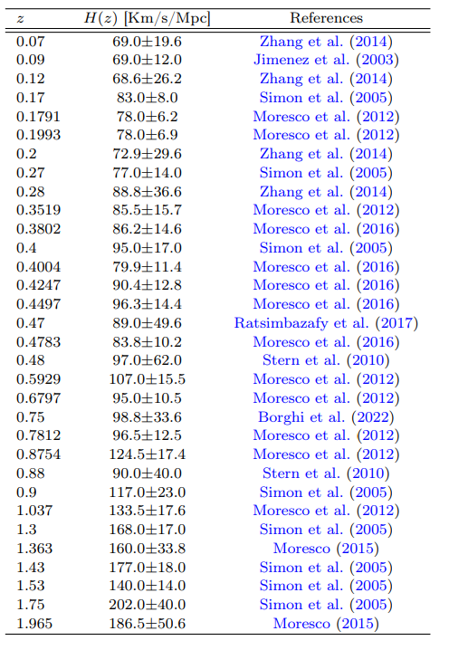

# Data Format & Files

The pipeline uses four datasets:

### Pantheon+ SH0ES (SN Ia)

Files:
- `Pantheon+SH0ES.dat`
- `Pantheon+SH0ES_STAT+SYS.cov`

### H(z) Compilation

- `HZ_compilation.csv`

<p align="center">
  
</p>

### SDSS DR12 BAO

- `sdss_DR12Consensus_bao.dat`
- `BAO_consensus_covtot_dM_Hz.txt`

### DESI DR2

- `desi_gaussian_bao_ALL_GCcomb_mean.txt`
- `desi_gaussian_bao_ALL_GCcomb_cov.txt`

All datasets are downloaded to:

```text
data/
├── bao
│   ├── BAO_consensus_covtot_dM_Hz.txt
│   └── sdss_DR12Consensus_bao.dat
├── desi
│   └── dr2
│       ├── desi_gaussian_bao_ALL_GCcomb_cov.txt
│       └── desi_gaussian_bao_ALL_GCcomb_mean.txt
├── hz
│   └── HZ_compilation.csv
├── out
├── pantheon_plus
│   ├── Pantheon+SH0ES.dat
│   └── Pantheon+SH0ES_STAT+SYS.cov
└──
```
